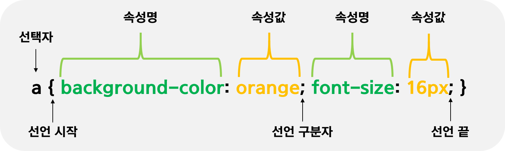

<h1>CSS 기초</h1>

<h2>1. CSS 개요</h2>
<p>
  웹페이지의 스타일과 내용적인 부분을 서로 분리해 놓은 서식을 스타일 시트라고 함<br>
  이러한 스타일 시트를 이용하면 웹페이지의 스타일을 편리하게 개발할 수 있음
</p>
  
<h2>2. CSS 기초</h2>
<h3> CSS 란? </h3>
<p>
  CSS는 Cascading Style Sheets의 약자<br>
  CSS는 HTML 요소들이 각종 미디어에서 어떻게 보이는가를 정의하는 데 사용되는 스타일 시트 언어<br>
  HTML4 부터는 이러한 모든 서식 설정을 HTML 문서로부터 따로 분리하는 것이 가능<br>
</p>
<h3> CSS를 사용하는 이유 </h3>
<p>
  CSS를 사용하는 이유는 HTML만으로 웹 페이지를 제작할 경우 HTML 요소의 세부 스타일을 일일이 따로 지정해주어야만 함<br>
  이 작업은 매우 많은 시간이 걸리고, 완성한 후에도 스타일 변경 및 유지 보수가 매우 힘들어짐<br>
  이러한 문제점을 해소하기 위해 W3C(World Wide Web Consortium)에서 만든 스타일 시트 언어가 바로 CSS<br>
</p>
<p>
  CSS는 웹 페이지의 스타일을 별도의 파일로 저자할 수 있게 해주므로 사이트의 전체 스타일을 손쉽게 제어할 수 있음<br>
  또한, 웹 사이트의 스타일을 일관성 있게 유지할 수 있게 해주며, 그에 따른 유지 보수 또한 쉬워짐<br>
  이러한 외부 스타일 시트는 보통 확장자를 .css 파일로 저장함<br>
</p>

<h2>3. CSS 문법</h2>
<h3>CSS 문법</h3>

<p>
  CSS의 문법은 선택자(selector)와 선언부(declaratives)로 구성<br>
  선택자는 CSS를 적용하고자 하는 HTML 요소(element)를 가르킴<br>
  선언부는 하나 이상의 선언들을 세미콜론(;)으로 구분하여 포함할 수 있으며, 중괄호({})를 사용해 전체를 둘러쌈<br>
  이러한 CSS 선언(declaration)은 언제나 마지막에 세미콜론(;)으로 끝마침
</p>

<h3>CSS 선택자</h3>
<p>
  스타일을 적용할 HTML 요소를 가르키는 데 사용하는 선택자는 아래와 같음<br>
</p>
- HTML 요소 선택자<br>
- 아이디(id) 선택자<br>
- 클래스(class) 선택자<br>
- 그룹(group) 선택자<br>
<br>
<blockquote>
  <h3> HTML 요소 선택자</h3>
  <p>
    CSS를 적용할 대상으로 HTML 요소의 이름을 직접 사용하여 선택할 수 있음
  </p>
  
  ```css
  <style>
    h2 { color: teal; text-decoration: underline; }
  </style>
  
  <h2> 이 부분에 스타일을 적용합니다.</h2>
  ```
</blockquote>

<blockquote>
  <h3>아이디(id) 선택자</h3>
  <p>
    아이디 선택자는 CSS를 적용할 대상으로 특정 요소를 선택할 때 사용<br>
    이 선택자는 웹 페이지에 포함된 여러 요소 중에서 특정 아이디 이름을 가지는 요소만을 선택
  </p>
  
  ```css
  <style>
    #heading { color: teal; text-decoration:line-through; }
  </style>
  
  <h2 id="heading">이 부분에 스타일을 적용</h2>
  ```
  
  <p>
    HTML과 CSS에서는 하나의 웹 페이지에 속하는 여러 요소에 같은 아이디 이름을 사용해도 별 문제없이 동작<br>
    하지만 이렇게 중복된 아이디를 가지고 자바스크립트 작업을 하게 되면 오류가 발생함<br>
    따라서 되도록이면 하나의 웹페이지에 속하는 요소에는 다른 이름을 사용하거나 클래스를 사용하는 것이 좋음
  </p>
</blockquote>

<blockquote>
  <h3>클래스(class) 선택자</h3>
  <p>
    클래스 선택자는 특정 집단의 여러 요소를 한 번에 선택할 때 사용<br>
    이러한 특정 집단을 클래스(class)라고 하며, 같은 클래스 이름을 가지는 요소들을 모두 선택해 줌
  </p>
  
  ```css
  <style>
    .headings { color: lime; text-decoration: overline; }
  </style>

  <h2 class="headings">이 부분에 스타일을 적용합니다.</h2>
  <p>class 선택자를 이용하여 스타일을 적용할 HTML 요소들을 한 번에 선택할 수 있습니다.</p>
  <h3 class="headings">이 부분에도 같은 스타일을 적용합니다.</h3>
  ```

</blockquote>

<blockquote>
  <h3>그룹(group) 선택자</h3>
  <p>
    그룹 선택자는 위에서 언급한 여러 선택자를 같이 사용하고자 할 떄 사용<br>
    그룹 선택자는 여러 선택자를 쉼표(,)로 구분하여 연결<br>
    이러한 그룹 선택자는 코드를 중복해서 작성하지 않도록 하여 코드를 간결하게 만들어 줌
  </p>
  
  ```css
  <style>
    h1 { color: navy; }
    h1, h2 { text-align: center; }
    h1, h2, p { background-color: lightgray; }
  </style>
  ```
</blockquote>

<h3>CSS 주석(comments)</h3>
<p>
  주석(comment)이란 개발자가 작성한 해당 코드에 대한 이해를 돕는 설명이나 디버깅을 위해 작성한 구문을 의미<br>
  이러한 주석은 다른 CSS 코드와는 달리 웹 브라우저에 의해 해석되지 않음
</p>

```css
/* 주석내용 */
```

<h2>4. CSS 적용</h2>
<h3> CSS 적용 방법</h3>
<p>
  HTML 문서에 CSS 스타일을 적용할 때에는 아래와 같은 세 가지 방법을 사용할 수 있음
  <br><br><br>
  1. 인라인 스타일(inline style)<br>
  2. 내부 스타일 시트(internal style sheet)<br>
  3. 외부 스타일 시트(external style sheet)<br>
</p>

<blockquote>
  <h3>인라인 스타일(inline style)</h3>
  <p>
    인라인 스타일이란 HTML 요소 내부에 style 속성을 사용하여 CSS 스타일을 적용하는 방법<br>
    이러한 인라인 스타일은 해당 요소에만 스타일을 적용
  </p>
  
  ```css
  <body>
    <h2 style="color:green; text-decoration:underline">
        인라인 스타일을 이용하여 스타일을 적용하였습니다.
    </h2>
  </body>
  ```
</blockquote>

<blockquote>
  <h3>내부 스타일 시트(internal style sheet)</h3>
  <p>
    내부 스타일 시트를 이용하는 방법은 HTML 문서 내의 &lt;head&gt;태그에 &lt;style&gt;태그를 사용하여 CSS 스타일을 적용<br>
    이러한 내부 스타일 시트는 해당 HTML 문서에만 스타일을 적용할 수 있음.
  </p>
  
  ```css
  <head>
    <style>
        body { background-color: lightyellow; }
        h2 { color: red; text-decoration: underline; }
    </style>
  </head>
  ```
</blockquote>

<blockquote>
  <h3>외부 스타일 시트(external style sheet)</h3>
  <p>
    외부 스타일 시트를 이용하는 방법은 웹 사이트 전체으 ㅣ스타일을 하나의 파일에서 변경할 수 있도록 해줌<br>
    외부에 작성된 이러한 스타일 시트 파일은 .css 확장자를 사용하여 저장<br>
    스타일을 적용할 웹 페이지의 <head>태그에 <link> 태그를 사용해 외부 스타일 시트를 포함해야만 스타일이 적용
  </p>
    
  ```css
  <head>
    <link rel="stylesheet" href="/examples/media/expand_style.css">
  </head>
  ```
</blockquote>
